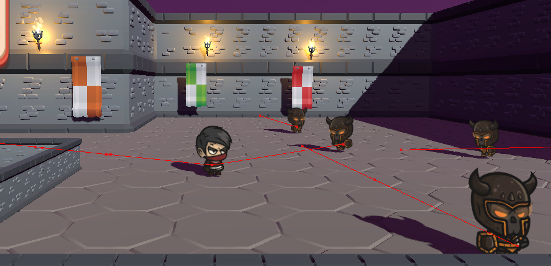
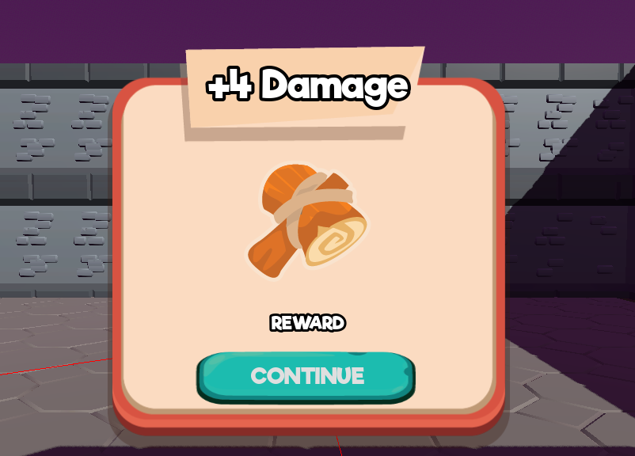

# godotLearrn

命名规范

EventName on<Name>
EventHandler Handle<Name>
EvenetRaiser Raise<Name>

Raising an event Raise<Name> 引发事件

着色器
spatial 3d 着色器
canvas_item 2d 着色器
sky 天空着色器
particle 粒子着色器
fog 雾着色器

游戏画面展示

